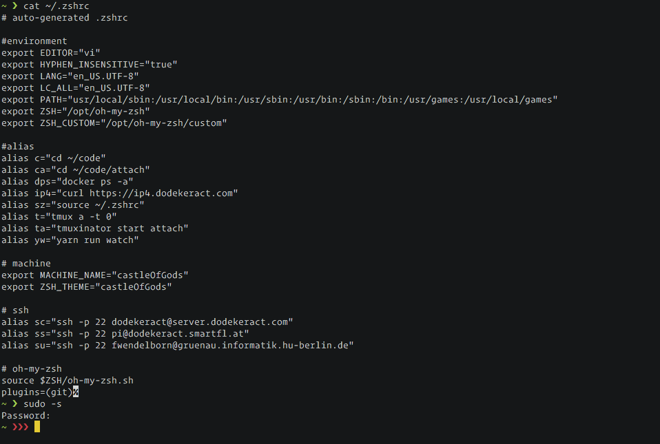

# Oh My ZSH

This generates & installs a customized `.zshrc` and `.zsh-theme` depending on `$MACHINE_TYPE`.



## Dependencies

[Oh-my-zsh](https://ohmyz.sh) must be installed in `/opt/Oh-my-zsh`.

## Installation

```shell
./install.sh
```

Note that this will ask for `$MACHINE_TYPE` and `$USER_GROUP`. E.g. `castleOfGods` and `dodekeract:dodekeract`
